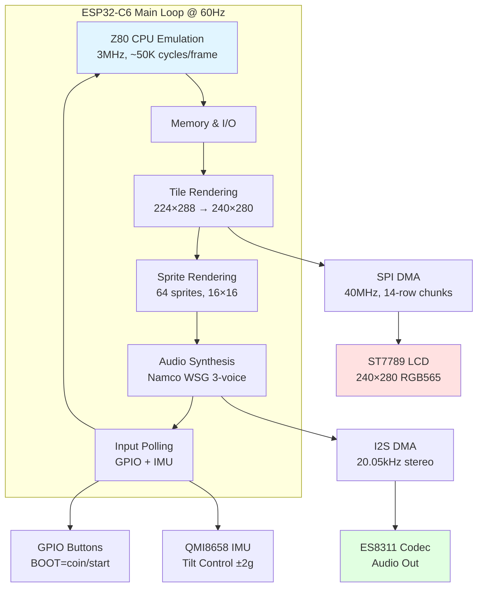
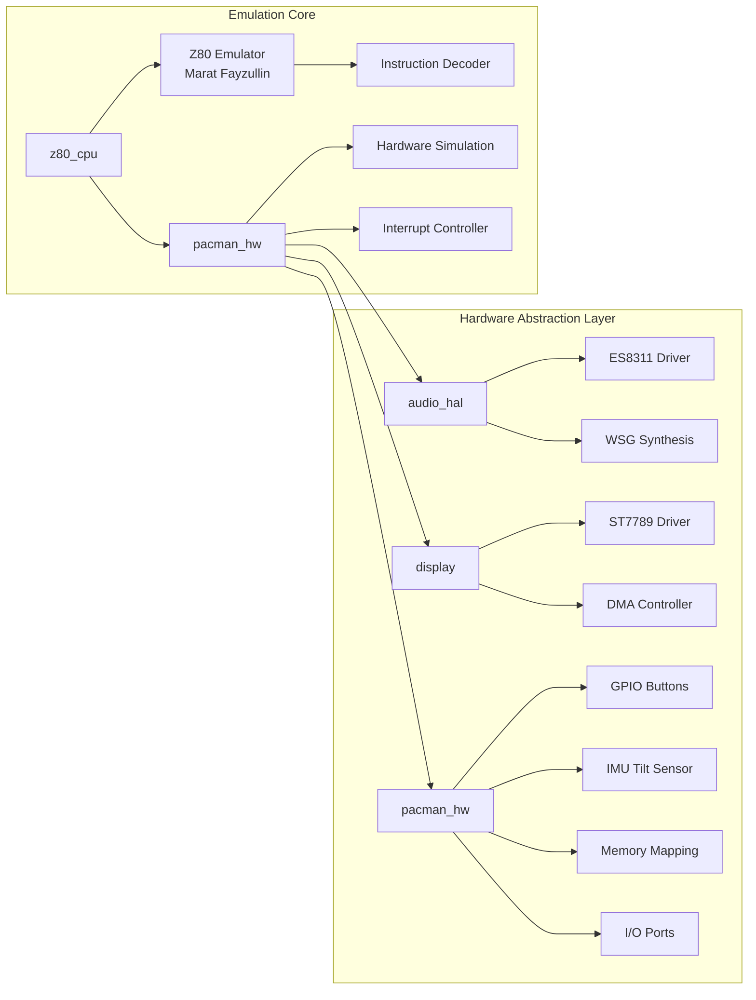
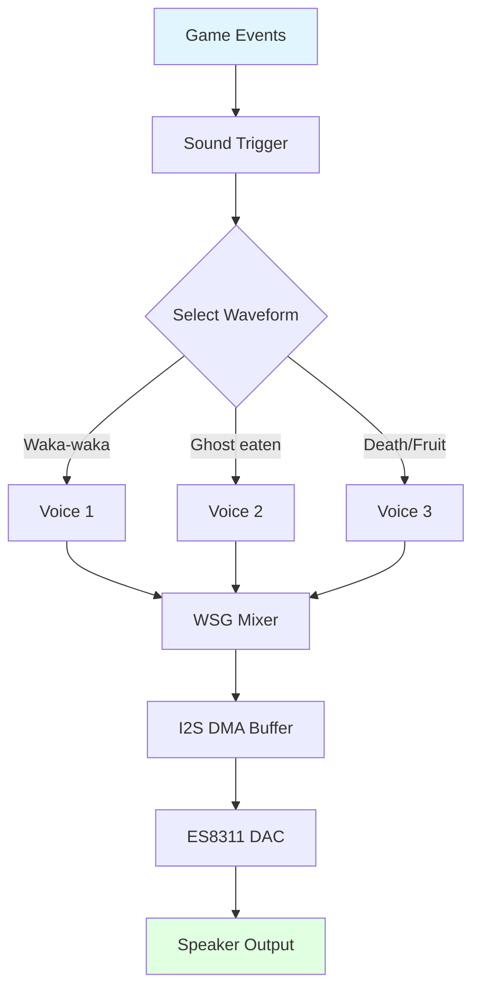

# PELLETINO

**Pac-Man Arcade Emulator for ESP32-C6**

A faithful recreation of the classic Pac-Man arcade game running on the ESP32-C6 microcontroller. Features authentic Z80 emulation, Namco WSG audio synthesis, smooth 60 FPS gameplay on a 240×280 ST7789 LCD display, and tilt-based controls via IMU sensor.

> **🎉 Project Origins:** PELLETINO was originally created as the [Official 2026 Fiesta San Antonio Medal](https://fiestasanantonio.org/), a wearable collectible pin with full arcade functionality. The Fiesta-specific version with intro video and custom branding is preserved in the [`FIESTA` branch](https://github.com/jesse-r-castro/PELLETINO/tree/FIESTA).

<p align="center">
  
</p>

<p align="center">
  <a href="https://github.com/espressif/esp-idf"></a>
  <a href="https://www.espressif.com/en/products/socs/esp32-c6"></a>
  <a href="LICENSE"></a>
</p>

## ✨ Features

- **Authentic Arcade Emulation** - Full Z80 CPU at original 3MHz speed with cycle-accurate instruction execution
- **60 FPS Graphics** - Hardware-accelerated sprite and tile rendering with SPI DMA
- **Original Audio** - Namco WSG wavetable synthesis with all classic sound effects
- **Tilt Controls** - QMI8658 IMU-based movement detection
- **Power Optimized** - CPU frequency scaling, adaptive backlight dimming, and tickless idle for extended battery life
- **Portable Design** - Compact 3D-printable enclosure perfect for handheld gaming

---

## 🔨 Getting Started

### Hardware Requirements

**Target Platform:** [Waveshare ESP32-C6-LCD-1.69](https://www.waveshare.com/esp32-c6-lcd-1.69.htm)

**Where to Buy:**
- 📦 **ESP32-C6-LCD-1.69:** [Amazon](https://a.co/d/hGBAeMq) (~$20)
- 🔋 **Battery (803040 LiPo 1000mAh):** [Amazon](https://a.co/d/05E4ZhiI) (~$9)

**📖 Detailed Documentation:** See [`docs/HARDWARE.md`](docs/HARDWARE.md) for complete pinouts, schematics, and connection details.

| Component | Specification |
|-----------|---------------|
| **MCU** | ESP32-C6 RISC-V @ 160MHz |
| **RAM** | 512KB HP SRAM |
| **Flash** | 4MB |
| **Display** | ST7789 240×280 @ 40MHz SPI |
| **Audio** | ES8311 I2C Codec + I2S |
| **IMU** | QMI8658 6-axis for tilt control |
| **Buttons** | GPIO9 (BOOT), GPIO18 (PWR) |
| **Battery** | 803040 3.7V LiPo 1000mAh |
| **USB** | USB-C for programming/charging |

### 3D Printed Enclosure

The `model/` directory contains STL files for a compact, portable enclosure:

**Print Settings:**
- **Material:** PETG (recommended for durability) or PLA
- **Layer Height:** 0.2mm
- **Infill:** 20%
- **Supports:** Tree supports on build plate only

**Assembly Hardware:**
- **4× M2×4mm screws** - Front assembly
- **4× M2×16mm screws** - Main case assembly
- **Optional:** Lanyard loop hardware for wearable use

### How to Use

**Controls:**
- **TOP Button:** Long press to turn off/on
- **MIDDLE Button:** Insert coin / Start game (long press to mute/unmute audio)
- **BOTTOM Button:** Reset
- **Tilt Control:** Move Pac-Man by tilting the device

**Gameplay:**
1. Press MIDDLE button to insert a coin and start
2. Tilt the device to guide Pac-Man through the maze
3. Eat all dots to advance levels
4. Avoid ghosts (or eat them after power pellets!)

**Battery & Charging:**
- USB-C charging port on device side
- Several hours of gameplay per charge
- Auto power management: CPU scaling, dimming, and audio optimization

---

### ROM Acquisition & Firmware Flashing

**IMPORTANT:** ROM files are **NOT included** in this repository and must be obtained legally.

#### Where to Get ROMs

1. **Internet Archive** (Recommended)
   - Visit [archive.org](https://archive.org/) and search for "Pac-Man MAME ROM"
   - Look for MAME 0.37b5 ROM set or similar public domain collections

2. **Own Original Hardware**
   - Extract ROMs from your legally owned Pac-Man PCB

#### Required ROM Files

Place these files in the `rom/` directory (one level above the project):

```
rom/
├── pacman.6e    (4096 bytes) - Program ROM 1
├── pacman.6f    (4096 bytes) - Program ROM 2
├── pacman.6h    (4096 bytes) - Program ROM 3
├── pacman.6j    (4096 bytes) - Program ROM 4
├── pacman.5e    (4096 bytes) - Tile graphics
├── pacman.5f    (4096 bytes) - Sprite graphics
├── 82s123.7f    (32 bytes)   - Color PROM
├── 82s126.4a    (256 bytes)  - Palette PROM
├── 82s126.1m    (256 bytes)  - Sound PROM 1
└── 82s126.3m    (256 bytes)  - Sound PROM 2
```

#### Build & Flash Steps

```bash
# 1. Clone repository
git clone https://github.com/jesse-r-castro/PELLETINO.git
cd PELLETINO

# 2. Convert ROMs (place ROM files in ../rom/ first)
python3 tools/convert_roms.py

# 3. Setup ESP-IDF environment
source ~/esp/esp-idf/export.sh  # Adjust path as needed
idf.py set-target esp32c6

# 4. Build and flash
idf.py build flash monitor
```

For complete build documentation, see the detailed sections below.

---

## 🔬 Technical Details & Architecture

### System Overview

PELLETINO implements authentic Pac-Man arcade hardware emulation on a single-core ESP32-C6 RISC-V processor:

**Key Features:**
- **Authentic Arcade Emulation** - Full Z80 CPU at original 3MHz speed
- **60 FPS Graphics** - Hardware-accelerated sprite and tile rendering
- **Original Audio** - Namco WSG wavetable synthesis with all sound effects
- **Tilt Controls** - IMU-based movement detection
- **Power Optimized** - CPU scaling, backlight dimming, and tickless idle

**Architecture Diagram:**



**Z80 CPU Emulation:**
- **Core:** Marat Fayzullin's portable Z80 emulator
- **Speed:** 3MHz (original Pac-Man arcade speed)
- **Accuracy:** Cycle-accurate instruction execution
- **Integration:** Runs ~50,000 Z80 cycles per frame (60Hz)
- **Memory:** 64KB address space with custom memory mapping for ROM/RAM

### Component Architecture



## � Complete Build Documentation

### Prerequisites

1. **ESP-IDF 5.x**
   - Install ESP-IDF following [Espressif's official guide](https://docs.espressif.com/projects/esp-idf/en/latest/esp32c6/get-started/index.html)
   - Ensure `idf.py` is in your PATH

2. **Python 3.8+**
   - Required for ROM conversion scripts
   - Standard library only (no additional packages needed)

3. **Git**
   - For cloning the repository

4. **Z80 CPU Emulator**
   - **Source:** Marat Fayzullin's Z80 emulator (included in `components/z80_cpu/`)
   - **License:** Freeware for non-commercial use
   - **No additional setup required** - already integrated into the project

### Detailed ROM Setup

### Step-by-Step Build Process

#### Step 1: Clone the Repository

```bash
git clone https://github.com/jesse-r-castro/PELLETINO.git
cd PELLETINO
```

#### Z80 CPU Emulator Setup

**IMPORTANT:** The Z80 CPU emulator must be downloaded separately:

- **Source:** Marat Fayzullin's portable Z80 emulator
- **Download:** http://fms.komkon.org/EMUL8/
- **Files needed:** `Z80.c`, `Z80.h`, `Tables.h`, and opcode table files
- **Installation:** Place files in `components/z80_cpu/src/` directory
- **License:** Freeware for non-commercial use (see credits section)

The emulator provides cycle-accurate Z80 CPU simulation running at the original Pac-Man arcade speed of 3MHz.

Place your ROM files in the `../rom/` directory (relative to project root):

```bash
# From project root, ROMs go here:
cd ../rom/
# Copy your ROM files here (see required files list above)

# Return to project and run conversion
cd PELLETINO
python3 tools/convert_roms.py
```

**Note:** The default ROM directory is `../../../rom/` from the tools directory, which resolves to `../rom/` from the project root.

The conversion script will:
- Validate ROM file sizes and checksums
- Convert graphics data to RGB565 format
- Generate tile and sprite lookup tables
- Create color palette mappings
- Extract Namco WSG wavetable data
- Output C header files ready for compilation

**Expected Output:**
```
Converting program ROMs...
  ✓ pacman.6e (4096 bytes)
  ✓ pacman.6f (4096 bytes)
  ✓ pacman.6h (4096 bytes)
  ✓ pacman.6j (4096 bytes)
Converting tile graphics...
  ✓ pacman.5e (256 tiles)
Converting sprite graphics...
  ✓ pacman.5f (64 sprites)
Converting color PROMs...
  ✓ 82s123.7f, 82s126.4a
Converting sound PROMs...
  ✓ 82s126.1m, 82s126.3m

✓ Conversion complete! Generated files:
  - main/roms/pacman_rom.h
  - main/roms/pacman_tilemap.h
  - main/roms/pacman_spritemap.h
  - main/roms/pacman_cmap.h
  - main/roms/pacman_wavetable.h
```

#### Step 3: Configure ESP-IDF

```bash
cd PELLETINO  # If still in rom directory

# Source ESP-IDF environment (adjust path as needed)
source ~/esp/esp-idf/export.sh

# Set ESP32-C6 as target
idf.py set-target esp32c6

# (Optional) Configure project settings
idf.py menuconfig
```

**Recommended menuconfig settings:**
- `Component config → ESP32C6-specific → CPU frequency → 160 MHz`
- `Component config → FreeRTOS → Tick rate (Hz) → 1000`
- `Serial flasher config → Flash size → 4 MB`

#### Step 4: Build

```bash
idf.py build
```

**Build Output:**
```
Project build complete. To flash, run:
  idf.py flash

Or to flash and monitor output:
  idf.py flash monitor
```

#### Step 5: Flash to Device

Connect your ESP32-C6 board via USB-C:

```bash
# Flash firmware
idf.py -p /dev/ttyUSB0 flash

# Flash and monitor serial output
idf.py -p /dev/ttyUSB0 flash monitor
```

**Note:** Replace `/dev/ttyUSB0` with your actual port:
- **Linux:** `/dev/ttyUSB0` or `/dev/ttyACM0`
- **macOS:** `/dev/cu.usbserial-*` or `/dev/cu.usbmodem-*`
- **Windows:** `COM3`, `COM4`, etc.

To find your port:
```bash
# Linux/macOS
ls /dev/tty*

# Or use ESP-IDF helper
idf.py --list-targets
```

#### Step 6: Play!

After flashing, the device will boot into Pac-Man:

- **BOOT (GPIO9):** Insert coin
- **PWR (GPIO18):** Power operations
- **IMU Tilt:** Movement control

### Quick Build Commands Reference

**Note:** All commands require ESP-IDF environment to be sourced first:
```bash
source ~/esp/esp-idf/export.sh  # Adjust path as needed
```

```bash
# Full build and flash cycle
idf.py build flash monitor

# Clean build
idf.py fullclean build

# Monitor only (after flashing)
idf.py monitor

# Exit monitor
Ctrl + ]

# Build size analysis
idf.py size-components
```

## 📁 Project Structure

```
PELLETINO/
├── main/                      # Application entry point
│   ├── main.c                 # Main game loop
│   ├── include/               # Public headers
│   ├── src/                   # Implementation files
│   └── roms/                  # Generated ROM headers (not in git)
│       ├── pacman_rom.h
│       ├── pacman_tilemap.h
│       ├── pacman_spritemap.h
│       ├── pacman_cmap.h
│       └── pacman_wavetable.h
│
├── components/                # Reusable components
│   ├── audio_hal/             # ES8311 + Namco WSG synthesis
│   │   ├── es8311.c           # Codec driver
│   │   └── wsg_synth.c        # Wavetable synthesizer
│   ├── display/               # ST7789 LCD driver
│   │   ├── st7789.c           # Display controller
│   │   └── dma_spi.c          # DMA-accelerated SPI
│   ├── z80_cpu/               # Z80 emulator (Marat Fayzullin)
│   │   ├── Z80.c              # CPU core implementation (download separately)
│   │   ├── Z80.h              # CPU core header (download separately)
│   │   └── z80_wrapper.c      # ESP32-C6 integration
│   ├── pacman_hw/             # Pac-Man hardware emulation
│   │   ├── pacman_hw.cpp      # Hardware abstraction
│   │   ├── pacman_input.cpp   # GPIO + IMU input handling
│   │   ├── pacman_video.cpp   # Tile/sprite rendering
│   │   └── qmi8658.cpp        # IMU tilt sensor driver
│   └── input/                 # (Deprecated - merged into pacman_hw)
│
├── tools/                     # Build tools
│   ├── convert_roms.py        # ROM converter
│   └── verify_checksums.py    # ROM validator
│
├── movie/                     # Video encoding tools (optional)
│   ├── make_fiesta.sh         # MJPEG encoder
│   └── find_optimal_video.sh  # Quality/size analysis
│
├── docs/                      # Documentation
│   ├── HARDWARE.md            # Hardware connections
│   ├── ROM_FORMAT.md          # ROM file specifications
│   └── AUDIO.md               # WSG synthesis details
│
├── CMakeLists.txt             # Main build config
├── sdkconfig.defaults         # ESP-IDF defaults
├── partitions.csv             # Flash partition table
└── .gitignore                 # Excludes ROMs and builds

### Display Settings

Edit `components/display/include/st7789.h`:

```c
#define LCD_WIDTH  240
#define LCD_HEIGHT 280
#define LCD_SPI_FREQ_HZ (40 * 1000 * 1000)  // 40MHz
```

### Audio Settings

Edit `components/audio_hal/include/wsg_synth.h`:

```c
#define WSG_SAMPLE_RATE 22050
#define WSG_CHANNELS 3           // Namco 3-voice
#define WSG_BUFFER_SIZE 512
```

### Input Configuration

Edit `components/pacman_hw/src/pacman_input.h`:

```c
#define PIN_BTN_BOOT    GPIO_NUM_9    // BOOT button
#define PIN_BTN_PWR     GPIO_NUM_18   // PWR button
#define IMU_ENABLED     1             // Set to 0 to disable tilt
```

### Memory Optimization

For devices with limited RAM, adjust in `sdkconfig`:

```
CONFIG_FREERTOS_HZ=1000
CONFIG_ESP_DEFAULT_CPU_FREQ_MHZ_160=y
CONFIG_COMPILER_OPTIMIZATION_PERF=y
```

## 🎵 Audio System

PELLETINO implements authentic Namco WSG (Waveform Sound Generator) synthesis:



**Implemented Sounds:**
- Pac-Man moving (waka-waka)
- Eating dots
- Eating power pellet
- Eating ghosts
- Collecting fruit
- Death sequence
- Intermission music
- Level start jingle

## 🔧 Developer Troubleshooting

### Build Errors

**Error: `fatal error: pacman_rom.h: No such file or directory`**
- **Solution:** Run `python3 tools/convert_roms.py` to generate ROM headers

**Error: `CMake Error: ESP-IDF Not Found`**
- **Solution:** Ensure ESP-IDF is installed and sourced:
  ```bash
  source ~/esp/esp-idf/export.sh  # Or your ESP-IDF path
  ```

### Flash Errors

**Error: `A fatal error occurred: Could not open port`**
- **Solution:** Check USB connection and permissions:
  ```bash
  # Linux - add user to dialout group
  sudo usermod -a -G dialout $USER
  # Then logout/login
  ```

**Error: `A fatal error occurred: Failed to connect to ESP32-C6`**
- **Solution:** Hold BOOT button while connecting, or reset board

### Runtime Issues

**Black screen after boot:**
- Check SPI connections to display
- Verify `idf.py menuconfig` → Display settings
- Monitor serial output: `idf.py monitor`

**No audio:**
- Verify I2S and I2C connections to ES8311
- Check audio codec initialization in logs
- Ensure speaker/headphones connected

**Slow performance:**
- Set CPU to 160MHz in menuconfig
- Enable compiler optimizations (`CONFIG_COMPILER_OPTIMIZATION_PERF`)
- Check for debug logging overhead

---

## 📚 Additional Resources

- **[Hardware Documentation](docs/HARDWARE.md)** - Complete pinouts, schematics, and wiring diagrams
- **[ROM Setup Guide](docs/ROM_SETUP.md)** - Detailed ROM conversion and format information  
- **[Contributing Guide](CONTRIBUTING.md)** - How to contribute to the project
- **[Changelog](CHANGELOG.md)** - Version history and updates
- **[Agent Notes](AGENTS.md)** - AI agent development notes

---

## 📄 Legal Notice

### ROM Files

This project requires original Pac-Man ROM files which are **NOT included** and must be obtained legally:

- ROM files are explicitly excluded from version control (`.gitignore`)
- You must own original Pac-Man arcade hardware OR obtain ROMs from legitimate sources
- ROMs are copyrighted by Bandai Namco Entertainment
- This project is for educational and preservation purposes only

### Third-Party Code

- **Z80 CPU Emulator** by Marat Fayzullin ([http://fms.komkon.org/EMUL8/](http://fms.komkon.org/EMUL8/))
  - Located in `components/z80_cpu/src/` (Z80.c, Tables.h, etc.)
  - Freeware license for non-commercial use
  - Provides cycle-accurate Z80 CPU emulation at 3MHz for authentic Pac-Man gameplay
- **[Galagino](https://github.com/harbaum/galagino)** by Till Harbaum - Reference implementation patterns for arcade emulation on ESP32
- **[MAME](https://www.mamedev.org/)** - Reference documentation for Pac-Man hardware specifications
- **ESP-IDF** by Espressif Systems (Apache 2.0 License)

### Disclaimer

This project is not affiliated with, endorsed by, or sponsored by Bandai Namco Entertainment. Pac-Man is a registered trademark of Bandai Namco Entertainment Inc.

## 🙏 Credits

- **Till Harbaum** - [Galagino project](https://github.com/harbaum/galagino) for ROM conversion insights and ESP32 arcade emulation techniques
- **MAME Development Team** - [MAME](https://www.mamedev.org/) hardware documentation and reference implementation
- **Marat Fayzullin** - [Z80 CPU emulator core](http://fms.komkon.org/EMUL8/)
- **Espressif Systems** - ESP-IDF framework
- **Namco** - Original Pac-Man arcade hardware and game design
- **Claude Opus & Sonnet 4.5** - Coding and documentation assistance
- **Community Contributors** - Bug reports, testing, and improvements

## 📜 License

See [LICENSE](LICENSE) file for details.

**Note:** This project is provided as-is for educational purposes. Users are responsible for ensuring legal compliance when obtaining and using ROM files.

---

<p align="center">
  <strong>Enjoy the classic arcade experience! 🎮👾</strong>
  <br><br>
  <em>Looking for the 2026 Fiesta medal version?</em>
  <br>
  Check out the <a href="https://github.com/jesse-r-castro/PELLETINO/tree/FIESTA">FIESTA branch</a>
  <br><br>
  <em>Questions? Found a bug? Want to contribute?</em>
  <br>
  Open an issue or PR on <a href="https://github.com/jesse-r-castro/PELLETINO">GitHub</a>
</p>
